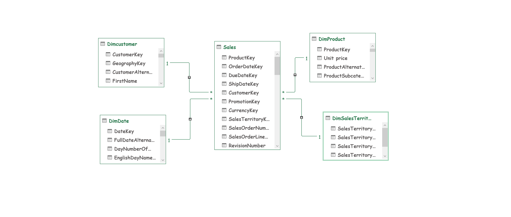
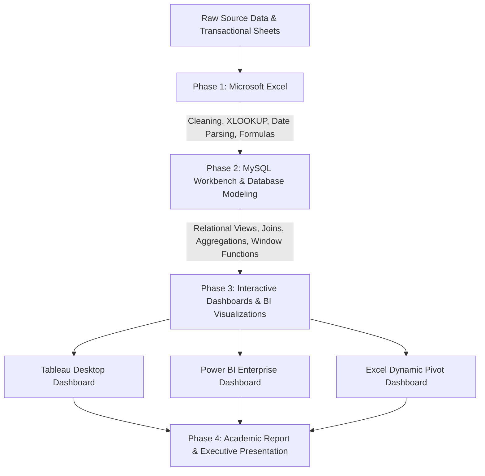
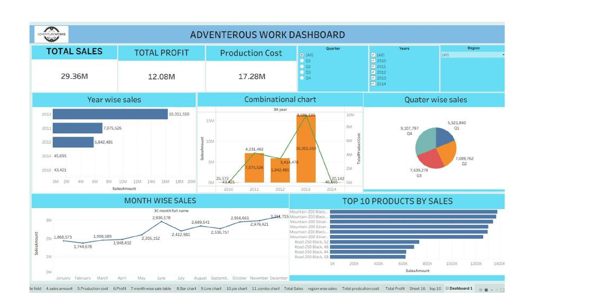
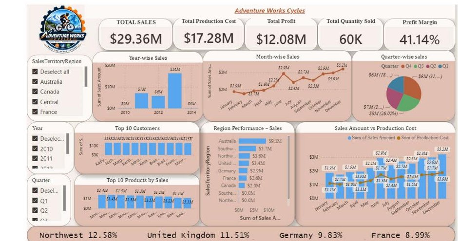
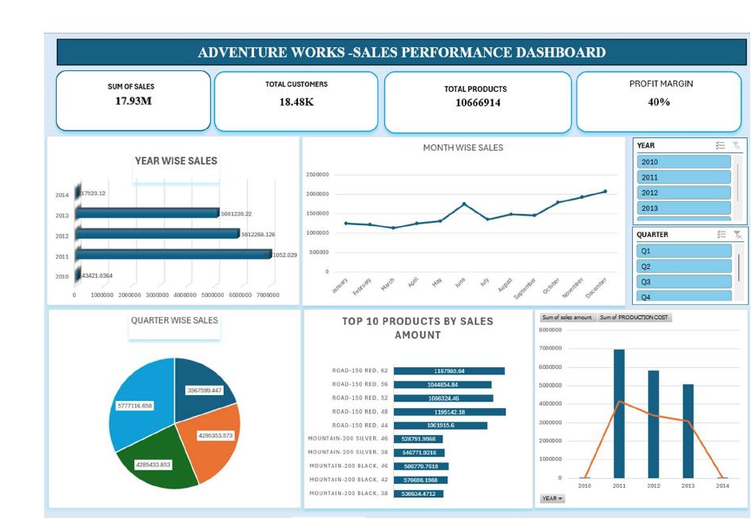

# 🚴 Adventure Works Sales Performance Analysis (2010–2014)

<p align="center">
  
  
  
  
  
  
</p>

---

## 📌 Executive Summary & Project Overview

**Adventure Works Cycles** is a large, multinational manufacturing company that designs and sells metal and composite bicycles, cycling accessories, and components across **North American, European, and Asian commercial markets**. Headquartered in **Bothell, Washington**, the company employs over 290 people supported by specialized regional sales teams worldwide.

Following consecutive years of market expansion and the integration of a specialized manufacturing plant in Mexico, company leadership commissioned this **end-to-end Data Analytics project** to evaluate historical sales performance, diagnose production cost efficiencies, uncover customer behavior patterns, and uncover high-growth regional opportunities between **2010 and 2014**.

This repository contains the complete academic course capstone project executed across four industry-standard analytical platforms: **Microsoft Excel**, **MySQL Workbench**, **Tableau**, and **Microsoft Power BI**.

---

## 📊 Key Headline Performance Metrics (2010–2014)

| Metric | Value | Business Interpretation |
| :--- | :--- | :--- |
| 💰 **Total Revenue (Sales)** | **$29.36 Million** | Aggregate gross sales generated across all global markets |
| 📈 **Total Net Profit** | **$12.08 Million** | Healthy bottom-line returns after standard production costs |
| 📦 **Total Order Volume** | **60,400 Orders** | High-volume transaction processing across retail & online streams |
| 🎯 **Overall Profit Margin** | **41.15%** | Robust, resilient profitability sustained across all product lines |
| 🏷️ **Average Order Value (AOV)** | **$486.09** | Consistent basket value per completed customer checkout |
| 🚀 **Peak Performance Year** | **2013 ($16.00M)** | Spectacular 2.7x growth (+170%) compared to 2012 |
| 🏆 **Top International Market** | **Australia ($9.06M)** | Leading market by sales volume outside of North America |
| 🥇 **Top Performing Product** | **Mountain-200 Black, 42 ($1.37M)** | Dominant revenue-driver among all bicycle subcategories |
| 👤 **Top Customer** | **Jordan Turner ($16.00K)** | Highest lifetime customer value in the analyzed period |
| 🗓️ **Strongest Quarter** | **Q4 (Holiday Peak)** | Consistent seasonal surge across every calendar year |

---

## 🏗️ Architecture & Data Modeling (Star Schema)

The analytical foundation is built on an industry-standard **Star-Schema Data Model**. The central fact table consolidates historical internet transactions and newer online orders, linked to six dimensional tables providing rich contextual granularity across customers, products, territories, and dates.



### Schema Components & Cardinality

| Table Name | Type | Key Column(s) | Description |
| :--- | :--- | :--- | :--- |
| `FactInternetSales` & `Fact_Internet_Sales_New` | **Fact Tables** | `SalesOrderNumber`, `SalesOrderLineNumber` | Transaction-level sales records, quantities, discounts, and costs. Combined via SQL View & Excel Union. |
| `DimCustomer` | **Dimension** | `CustomerKey` | Customer demographics, full names, marital status, income, and geography. |
| `DimProduct` | **Dimension** | `ProductKey` | Master product catalog, model names, colors, standard costs, and list prices. |
| `DimProductSubcategory` | **Dimension** | `ProductSubcategoryKey` | Granular product groupings (e.g., Mountain Bikes, Road Bikes, Touring Bikes). |
| `DimProductCategory` | **Dimension** | `ProductCategoryKey` | Top-level classifications (Bikes, Components, Clothing, Accessories). |
| `DimSalesTerritory` | **Dimension** | `SalesTerritoryKey` | Global regions, countries, and regional sales groups (North America, Europe, Pacific). |
| `DimDate` | **Dimension** | `DateKey` / `OrderDateKey` | Standard calendar dates, fiscal quarters, financial months, and weekdays. |

---

## 🔄 End-to-End Analytics Workflow



### Phase 1: Microsoft Excel Data Engineering & Analysis
- **Data Consolidation**: Unioned `FactInternetSales` and `Fact_Internet_Sales_New` into a unified `SALES` worksheet containing over 60,000 transaction records.
- **Relational Lookups**: Implemented `XLOOKUP` and `VLOOKUP` routines to fetch Product Names, Customer Full Names, and Unit Prices from dimension sheets.
- **Date Feature Engineering**: Derived `Year`, `Month Number`, `Month Full Name`, `Quarter (Q1-Q4)`, `Year-Month`, `Weekday Number`, `Weekday Name`, `Financial Month`, and `Financial Quarter`.
- **Financial Calculations**:
  - `Sales Amount = UnitPrice * OrderQuantity * (1 - UnitPriceDiscountPct)`
  - `Production Cost = ProductStandardCost * OrderQuantity`
  - `Profit = Sales Amount - Production Cost`
- **Exploratory Analysis**: Developed multidimensional Pivot Tables and Pivot Charts analyzing year-over-year revenue, product category contributions, and quarterly trends.

---

### Phase 2: MySQL Workbench & SQL Scripting

A unified view `v_UnionedSales` was engineered to serve as the single source of truth across all 17 assigned analytical problems.

```sql
CREATE OR REPLACE VIEW v_UnionedSales AS
    SELECT * FROM factinternetsales 
    UNION ALL 
    SELECT * FROM factinternetsalesnew;
```

#### Analytical Queries & Business Outputs Breakdown

#### 1. Product Name Lookup
```sql
SELECT s.*, p.EnglishProductName AS ProductName
FROM v_UnionedSales s
LEFT JOIN dimproduct p ON s.ProductKey = p.ProductKey;
```
* **Output / Objective**: Merges the descriptive English product name onto every sales line item to enable product-level grouping.

#### 2. Customer Full Name & Unit Price Lookup
```sql
SELECT 
    CONCAT(c.FirstName, ' ', COALESCE(c.MiddleName, ''), ' ', c.LastName) AS CustomerFullName,
    p.EnglishProductName AS ProductName,
    s.UnitPrice
FROM sales s
JOIN dimcustomer c ON s.CustomerKey = c.CustomerKey
JOIN dimproduct p ON s.ProductKey = p.ProductKey;
```
* **Output / Objective**: Builds an enriched customer-product interaction view handling optional middle names cleanly with `COALESCE`.

#### 3. Comprehensive Date Attributes Transformation
```sql
SELECT 
    OrderDateKey,
    STR_TO_DATE(CAST(OrderDateKey AS CHAR), '%Y%m%d') AS OrderDateParsed,
    YEAR(STR_TO_DATE(CAST(OrderDateKey AS CHAR), '%Y%m%d')) AS OrderYear,
    MONTH(STR_TO_DATE(CAST(OrderDateKey AS CHAR), '%Y%m%d')) AS OrderMonthNo,
    MONTHNAME(STR_TO_DATE(CAST(OrderDateKey AS CHAR), '%Y%m%d')) AS OrderMonthFullName,
    CONCAT('Q', QUARTER(STR_TO_DATE(CAST(OrderDateKey AS CHAR), '%Y%m%d'))) AS OrderQuarter,
    DATE_FORMAT(STR_TO_DATE(CAST(OrderDateKey AS CHAR), '%Y%m%d'), '%Y-%b') AS OrderYearMonth,
    DAYOFWEEK(STR_TO_DATE(CAST(OrderDateKey AS CHAR), '%Y%m%d')) AS OrderWeekdayNo,
    DAYNAME(STR_TO_DATE(CAST(OrderDateKey AS CHAR), '%Y%m%d')) AS OrderWeekdayName,
    MOD(MONTH(STR_TO_DATE(CAST(OrderDateKey AS CHAR), '%Y%m%d')) + 5, 12) + 1 AS FinancialMonth,
    CONCAT('FQ', CEILING((MOD(MONTH(STR_TO_DATE(CAST(OrderDateKey AS CHAR), '%Y%m%d')) + 5, 12) + 1) / 3.0)) AS FinancialQuarter
FROM v_UnionedSales;
```
* **Output / Objective**: Generates granular temporal dimensions (Calendar & Fiscal periods starting in July).

#### 4, 5 & 6. Sales Amount, Production Cost, and Net Profit
```sql
SELECT 
    SalesOrderNumber,
    (UnitPrice * OrderQuantity * (1 - (IFNULL(UnitPriceDiscountPct, 0) / 100.0))) AS CalculatedSalesAmount,
    (ProductStandardCost * OrderQuantity) AS CalculatedProductionCost,
    ((UnitPrice * OrderQuantity * (1 - (IFNULL(UnitPriceDiscountPct, 0) / 100.0))) - (ProductStandardCost * OrderQuantity)) AS CalculatedProfit
FROM v_UnionedSales;
```
* **Output / Objective**: Calculates row-level gross receipts, manufacturing costs, and net margins accounting for promotional discounts.

#### 7. Monthly Pivot Query with Dynamic Year Filter (e.g., 2014)
```sql
SELECT 
    MONTHNAME(STR_TO_DATE(CAST(OrderDateKey AS CHAR), '%Y%m%d')) AS Month,
    SUM(UnitPrice * OrderQuantity * (1 - (IFNULL(UnitPriceDiscountPct, 0) / 100.0))) AS TotalSales
FROM v_UnionedSales
WHERE YEAR(STR_TO_DATE(CAST(OrderDateKey AS CHAR), '%Y%m%d')) = 2014
GROUP BY MONTH(STR_TO_DATE(CAST(OrderDateKey AS CHAR), '%Y%m%d')), MONTHNAME(STR_TO_DATE(CAST(OrderDateKey AS CHAR), '%Y%m%d'))
ORDER BY MONTH(STR_TO_DATE(CAST(OrderDateKey AS CHAR), '%Y%m%d'));
```
* **Output / Objective**: Provides a targeted monthly revenue breakdown for any selected fiscal or calendar year.

#### 8. Year-Wise Total Sales
```sql
SELECT 
    YEAR(STR_TO_DATE(CAST(OrderDateKey AS CHAR), '%Y%m%d')) AS Year,
    SUM(UnitPrice * OrderQuantity * (1 - (IFNULL(UnitPriceDiscountPct, 0) / 100.0))) AS TotalSales
FROM v_UnionedSales
GROUP BY YEAR(STR_TO_DATE(CAST(OrderDateKey AS CHAR), '%Y%m%d'))
ORDER BY Year;
```
* **Output / Objective**: Demonstrates the macro growth curve from 2010 through 2014, showing the massive revenue jump in 2013.

#### 9. Month-Wise Chronological Sales Trend
```sql
SELECT 
    DATE_FORMAT(STR_TO_DATE(CAST(OrderDateKey AS CHAR), '%Y%m%d'), '%Y-%b') AS YearMonth,
    SUM(UnitPrice * OrderQuantity * (1 - (IFNULL(UnitPriceDiscountPct, 0) / 100.0))) AS TotalSales
FROM v_UnionedSales
GROUP BY DATE_FORMAT(STR_TO_DATE(CAST(OrderDateKey AS CHAR), '%Y%m%d'), '%Y-%b'), STR_TO_DATE(CAST(OrderDateKey AS CHAR), '%Y%m')
ORDER BY STR_TO_DATE(CAST(OrderDateKey AS CHAR), '%Y%m');
```
* **Output / Objective**: Uncovers granular seasonality, peak buying months, and recurring demand spikes.

#### 10. Quarter-Wise Aggregate Sales (Q1 to Q4)
```sql
SELECT 
    CONCAT('Q', QUARTER(STR_TO_DATE(CAST(OrderDateKey AS CHAR), '%Y%m%d'))) AS Quarter,
    SUM(UnitPrice * OrderQuantity * (1 - (IFNULL(UnitPriceDiscountPct, 0) / 100.0))) AS TotalSales
FROM v_UnionedSales
GROUP BY CONCAT('Q', QUARTER(STR_TO_DATE(CAST(OrderDateKey AS CHAR), '%Y%m%d')))
ORDER BY Quarter;
```
* **Output / Objective**: Confirms Q4 as the highest-grossing quarter due to holiday cycling demand.

#### 11. Dual-Axis Combo: Sales Amount vs. Production Cost
```sql
SELECT 
    DATE_FORMAT(STR_TO_DATE(CAST(OrderDateKey AS CHAR), '%Y%m%d'), '%Y-%b') AS YearMonth,
    SUM(UnitPrice * OrderQuantity * (1 - (IFNULL(UnitPriceDiscountPct, 0) / 100.0))) AS TotalSalesAmount,
    SUM(ProductStandardCost * OrderQuantity) AS TotalProductionCost
FROM v_UnionedSales
GROUP BY DATE_FORMAT(STR_TO_DATE(CAST(OrderDateKey AS CHAR), '%Y%m%d'), '%Y-%b'), STR_TO_DATE(CAST(OrderDateKey AS CHAR), '%Y%m')
ORDER BY STR_TO_DATE(CAST(OrderDateKey AS CHAR), '%Y%m');
```
* **Output / Objective**: Verifies that manufacturing costs scale predictably below revenue, maintaining strong gross margins across all operational months.

#### 12. Core KPIs: Top Products, Top Customers & Regional Distribution
```sql
-- Top 10 Products
SELECT p.EnglishProductName AS ProductName,
       SUM(s.UnitPrice * s.OrderQuantity * (1 - (IFNULL(s.UnitPriceDiscountPct, 0) / 100.0))) AS TotalSales
FROM v_UnionedSales s JOIN dimproduct p ON s.ProductKey = p.ProductKey
GROUP BY p.EnglishProductName ORDER BY TotalSales DESC LIMIT 10;

-- Top 10 Customers
SELECT CONCAT(c.FirstName, ' ', IFNULL(c.MiddleName, ''), ' ', c.LastName) AS CustomerFullName,
       SUM(s.UnitPrice * s.OrderQuantity * (1 - (IFNULL(s.UnitPriceDiscountPct, 0) / 100.0))) AS TotalSales
FROM v_UnionedSales s JOIN dimcustomer c ON s.CustomerKey = c.CustomerKey
GROUP BY CustomerFullName ORDER BY TotalSales DESC LIMIT 10;

-- Regional Performance
SELECT t.SalesTerritoryRegion AS Region,
       SUM(s.UnitPrice * s.OrderQuantity * (1 - (IFNULL(s.UnitPriceDiscountPct, 0) / 100.0))) AS TotalSales
FROM v_UnionedSales s JOIN dimsalesterritory t ON s.SalesTerritoryKey = t.SalesTerritoryKey
GROUP BY t.SalesTerritoryRegion ORDER BY TotalSales DESC;
```
* **Output / Objective**: Identifies Mountain bike models as top revenue drivers, names Jordan Turner as top customer ($16K), and confirms Southwest USA and Australia as top revenue regions.

#### 13. Advanced SQL: Year-over-Year (YoY) Sales Growth with `LAG()`
```sql
WITH YearlySales AS (
    SELECT 
        YEAR(OrderDate) AS SalesYear,
        SUM(UnitPrice * OrderQuantity * (1 - UnitPriceDiscountPct)) AS TotalSales
    FROM v_unionedsales
    GROUP BY YEAR(OrderDate)
)
SELECT 
    SalesYear,
    TotalSales,
    LAG(TotalSales) OVER (ORDER BY SalesYear) AS PreviousYearSales,
    ((TotalSales - LAG(TotalSales) OVER (ORDER BY SalesYear)) / LAG(TotalSales) OVER (ORDER BY SalesYear)) * 100 AS YoY_Growth_Percentage
FROM YearlySales;
```
* **Output / Objective**: Quantifies annual percentage growth, highlighting the extraordinary revenue leap in 2013.

#### 14. Advanced SQL: Monthly Cumulative Running Total
```sql
WITH MonthlySales AS (
    SELECT 
        YEAR(OrderDate) AS SalesYear,
        MONTH(OrderDate) AS SalesMonth,
        SUM(UnitPrice * OrderQuantity * (1 - UnitPriceDiscountPct)) AS MonthlySalesAmount
    FROM v_unionedsales
    GROUP BY YEAR(OrderDate), MONTH(OrderDate)
)
SELECT 
    SalesYear,
    SalesMonth,
    MonthlySalesAmount,
    SUM(MonthlySalesAmount) OVER (ORDER BY SalesYear, SalesMonth ROWS BETWEEN UNBOUNDED PRECEDING AND CURRENT ROW) AS CumulativeMonthlySales
FROM MonthlySales;
```
* **Output / Objective**: Tracks lifetime cumulative capital accumulation reaching $29.36M at the end of the project timeframe.

#### 15. Advanced SQL: Best Selling Product Category
```sql
SELECT 
    pc.EnglishProductCategoryName AS ProductCategory,
    SUM(s.UnitPrice * s.OrderQuantity * (1 - s.UnitPriceDiscountPct)) AS TotalSalesAmount
FROM v_unionedsales s
JOIN dimproduct p ON s.ProductKey = p.ProductKey
JOIN dimproductsubcategory psc ON p.ProductSubcategoryKey = psc.ProductSubcategoryKey
JOIN dimproductcategory pc ON psc.ProductCategoryKey = pc.ProductCategoryKey
GROUP BY pc.EnglishProductCategoryName
ORDER BY TotalSalesAmount DESC
LIMIT 1;
```
* **Output / Objective**: Proves that **Bikes** generate more than 85% of company-wide sales, towering over Clothing and Accessories.

#### 16. Advanced SQL: Highest Profit-Generating Products
```sql
SELECT 
    p.EnglishProductName AS ProductName,
    SUM((s.UnitPrice * s.OrderQuantity * (1 - s.UnitPriceDiscountPct)) - (s.ProductStandardCost * s.OrderQuantity)) AS TotalProfit
FROM v_unionedsales s
JOIN dimproduct p ON s.ProductKey = p.ProductKey
GROUP BY p.EnglishProductName
ORDER BY TotalProfit DESC
LIMIT 10;
```
* **Output / Objective**: Ranks items by true profit contribution, ensuring marketing focuses on high-margin models rather than solely volume.

#### 17. Advanced SQL: Customer Ranking with `DENSE_RANK()`
```sql
SELECT 
    c.CustomerKey,
    CONCAT(c.FirstName, ' ', COALESCE(c.MiddleName, ''), ' ', c.LastName) AS CustomerFullName,
    SUM(s.UnitPrice * s.OrderQuantity * (1 - s.UnitPriceDiscountPct)) AS TotalSalesAmount,
    DENSE_RANK() OVER (ORDER BY SUM(s.UnitPrice * s.OrderQuantity * (1 - s.UnitPriceDiscountPct)) DESC) AS CustomerRank
FROM v_unionedsales s
JOIN dimcustomer c ON s.CustomerKey = c.CustomerKey
GROUP BY c.CustomerKey, CustomerFullName;
```
* **Output / Objective**: Assigns competitive customer rankings to support VIP loyalty programs and account-based marketing.

---

## 📈 Interactive Dashboards & Visualizations

### 1. Tableau Executive Dashboard
The Tableau workbook (`Tableau/AdvWorksTableauProject.twbx`) provides a holistic sales overview with dynamic cross-filtering:
- **KPI Summary Cards**: Total Sales ($29.36M), Total Profit ($12.08M), and Production Cost ($17.28M).
- **Dual-Axis Trend**: Year-wise sales plotted in comparison with manufacturing cost.
- **Quarterly Distribution**: Donut/Pie visual showing sales weight across Q1 through Q4.
- **Monthly Trajectory**: Continuous line chart showing multi-year trend patterns.
- **Top 10 Product Leaderboard**: Ranked bar chart of highest-grossing models.
- **Interactive Multi-Slicers**: Slice by Year, Quarter, and Geographic Region.



---

### 2. Power BI Enterprise Dashboard
The Power BI report (`PowerBi/AdventureWorksPowerBiProjectNew.pbix`) delivers deep regional and customer intelligence with interactive DAX measures:
- **Top KPI Ribbon**: Total Sales, Total Cost, Total Profit, Quantity Sold, and Profit Margin (41.15%).
- **Regional Breakdown**: Sales distribution across sales territories (Southwest, Northwest, Australia, UK, Germany, etc.).
- **Monthly Trends & Quarterly Proportions**: Multi-chart visual synchronization.
- **Customer & Product Rankings**: Top 10 customers and top 10 products.
- **Cost vs. Sales Combo**: Synchronized bar and area/line visual tracking gross margin over time.
- **Interactive Slicers**: Instant drill-down by Region, Year, and Quarter.



---

### 3. Microsoft Excel Interactive Dashboard
The Excel workbook (`Excel/PROJECT ADVENTURES WORK 1.xlsx`) demonstrates enterprise-grade spreadsheet design:
- **Dynamic KPI Cards**: Total Revenue, Total Customer Count, Product Count, and Profit Margin.
- **Yearly Sales Trend (2010–2014)**: Clean bar chart illustrating year-over-year revenue expansion.
- **Monthly Sales Line Pattern**: Seasonal performance across calendar months.
- **Quarterly Sales Breakdown**: Proportional contribution chart.
- **Top 10 Products by Sales**: Clear bar chart breakdown.
- **Timeline & Dimension Slicers**: Seamless filtering across years and quarters.



---

## 💡 Strategic Business Insights & Actionable Recommendations

> [!IMPORTANT]
> ### 1. Capitalize on Mountain Bike Dominance
> Mountain bikes account for the vast majority of top-tier revenue and highest profit margins (led by **Mountain-200 Black, 42** at $1.37M). 
> **Recommendation**: Protect inventory levels of high-margin frame sizes and package them with premium cycling accessories to increase basket size.

> [!TIP]
> ### 2. Expand the Australian & Southwest Playbook
> While Southwest USA leads domestic sales, **Australia achieved an impressive $9.06M**, proving exceptionally high international demand.
> **Recommendation**: Replicate the Australian distribution and localized marketing model across underperforming European territories (e.g., France and Germany).

> [!NOTE]
> ### 3. Seasonal Pre-Ordering & Inventory Buffer for Q4
> Across all five years, **Q4 consistently outperforms Q1–Q3** due to holiday gift purchases and end-of-year cycling sales.
> **Recommendation**: Optimize supply chain lead times by ramping up component production in the Mexico facility by August to prevent stockouts in November and December.

> [!TIP]
> ### 4. Launch a VIP Loyalty Program for Top Customers
> The top 10 customers have each accumulated between **$13K and $16K** in lifetime purchases.
> **Recommendation**: Institute an exclusive concierge loyalty tier offering early access to new releases, free annual bike tune-ups, and bespoke accessories.

---

## 📁 Repository Directory Structure

```plaintext
Adventure-Works/
│
├── .gitignore                                   # Ignore OS & temporary files
├── README.md                                    # Complete project documentation & outputs
│
├── assets/
│   └── images/
│       ├── data_model_star_schema.png           # Star-schema data architecture
│       ├── tableau_dashboard.png                # Tableau interactive dashboard
│       ├── powerbi_dashboard.png                # Power BI business intelligence dashboard
│       └── excel_dashboard.png                  # Excel dynamic pivot dashboard
│
├── Excel/
│   └── PROJECT ADVENTURES WORK 1.xlsx           # Excel workbook with formulas, lookups & pivot tables
│
├── MySQL/
│   ├── AdventureWorkDatabase.sql                # Complete MySQL database export (tables, data, keys)
│   └── adventureworks.sql                       # 17 comprehensive SQL queries & advanced analytics
│
├── PowerBi/
│   └── AdventureWorksPowerBiProjectNew.pbix     # Power BI data model, DAX measures & visuals
│
├── Tableau/
│   └── AdvWorksTableauProject.twbx              # Tableau packaged workbook with interactive dashboards
│
└── Report/
    ├── AdventureWorks_Sales_Analysis (2).pptx   # Executive presentation slide deck (15 slides)
    └── Adventure_works_Report.pdf              # Comprehensive academic final report document
```

---

## 👥 Academic Project Team – Group 4

This project was developed as a course academic capstone by **Group 4**:

| Team Member | Academic Project Role | Key Contributions |
| :--- | :--- | :--- |
| **Akshay Rathod** | **Data Analyst (Lead)** | SQL query architecture, Power BI dashboard development, end-to-end analytics workflow & documentation |
| **Ega Venkat Sai** | **Data Analyst** | Data transformation, Excel modeling, pivot tables & chart design |
| **Usirikayala Vishnu Vamsi** | **Data Analyst** | MySQL database schema design, view creation & window function queries |
| **Bathala Siva Kumar** | **Data Analyst** | Tableau workbook development, visual design & multi-parameter slicers |
| **Pratyush Parashar** | **Business Analyst** | Business requirement mapping, KPI formulation & executive presentation deck |
| **Hitesh Prajapati** | **Data Analyst** | Power Query data cleaning, star-schema data modeling & DAX measures |
| **Prashant Pankaj Singh** | **Data Analyst** | Comprehensive reporting, exploratory data validation & statistical verification |

---

## 🚀 Setup & Reproduction Guide

### 1. MySQL Database Restoration
1. Ensure **MySQL Server 8.0+** and **MySQL Workbench** are installed.
2. Open MySQL Workbench and execute the full dump to restore schema and records:
   ```bash
   mysql -u root -p < MySQL/AdventureWorkDatabase.sql
   ```
3. Open and run the analytical script `MySQL/adventureworks.sql` to generate views, KPIs, and advanced window queries.

### 2. Microsoft Excel Workbook
- Requires **Microsoft Excel 2016** or newer (supports `XLOOKUP`, Dynamic Arrays, and Modern Pivot Tables).
- Open `Excel/PROJECT ADVENTURES WORK 1.xlsx` to inspect data cleaning, calculated columns, and interactive dashboard sheets.

### 3. Microsoft Power BI
- Requires **Power BI Desktop** (latest free edition).
- Open `PowerBi/AdventureWorksPowerBiProjectNew.pbix` to interact with the star schema, explore DAX formulas, and test cross-visual filtering.

### 4. Tableau Desktop
- Requires **Tableau Desktop** or **Tableau Reader**.
- Open `Tableau/AdvWorksTableauProject.twbx` to interact with packaged data, calculated fields, and interactive dashboard filters.

---

## 📜 Academic Disclaimer & License
This project is an academic capstone created using the publicly available Microsoft AdventureWorks sample dataset for educational and analytical purposes.

Distributed under the **MIT License**. Feel free to use this repository as a reference for data analytics workflows, SQL scripting, and business intelligence dashboard design.
