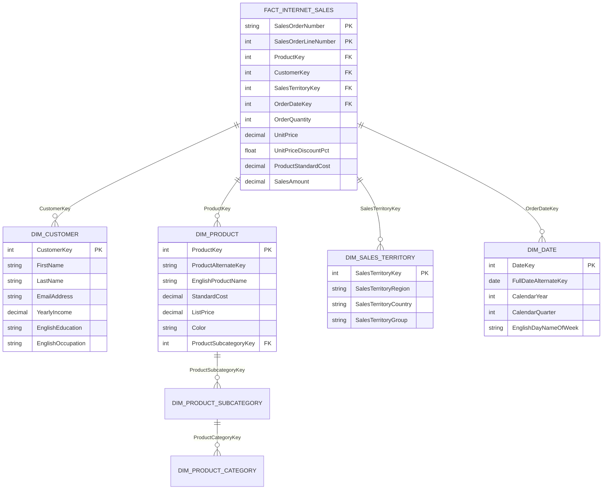
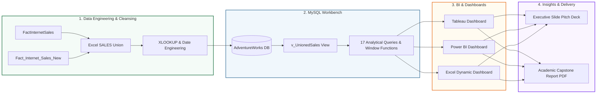

<div align="center">

# 🚴 Adventure Works Cycles: Sales Performance & BI Analytics
### *End-to-End Enterprise Data Analytics & Business Intelligence Capstone (2010–2014)*

[](#-academic-project-team--group-4)
[](Excel/PROJECT%20ADVENTURES%20WORK%201.xlsx)
[](MySQL/adventureworks.sql)
[](PowerBi/AdventureWorksPowerBiProjectNew.pbix)
[](Tableau/AdvWorksTableauProject.twbx)
[](#-dax-measures--excel-formulas-reference)

<br/>

[](https://github.com/Akshay-Notfound/Adventure-Works)
[](https://github.com/Akshay-Notfound/Adventure-Works/commits/main)
[](LICENSE)
[](#-executive-summary)

---

### ⚡ Quick Navigation Pills
[📌 Overview](#-executive-summary) • [📊 KPI Scorecards](#-interactive-kpi-scorecards) • [🏗️ Data Model (ERD)](#-architecture--star-schema-erd) • [🔄 4-Phase Workflow](#-end-to-end-analytics-pipeline) • [🗄️ SQL Analytics (17 Queries)](#-mysql-analytical-queries--solutions-catalog) • [📈 Dashboards](#-interactive-dashboards--visualizations) • [💡 Business Insights](#-strategic-business-insights--actionable-matrix) • [👥 Team](#-academic-project-team--group-4) • [🚀 Quickstart](#-quickstart--reproduction-guide)

---

</div>

## 📌 Executive Summary

**Adventure Works Cycles** is a premier multinational manufacturing company specializing in commercial metal and composite bicycles, cycling accessories, and performance gear across **North American, European, and Asian markets**. Headquartered in **Bothell, Washington**, operations are supported by a manufacturing subcomponent plant in Mexico and global distribution hubs.

This repository hosts the **complete, end-to-end academic capstone analytics project** developed by **Group 4**. By leveraging transactional sales records spanning **2010 to 2014**, our team engineered relational database models, executed advanced SQL window analyses, and created interactive multi-platform business intelligence dashboards across **Microsoft Excel**, **MySQL**, **Tableau**, and **Microsoft Power BI**.

```
┌───────────────────────────┬───────────────────────────┬───────────────────────────┐
│   TOTAL GLOBAL REVENUE    │      TOTAL NET PROFIT     │     OVERALL PROFIT MARGIN │
│         $29.36M           │          $12.08M          │          41.15%           │
├───────────────────────────┼───────────────────────────┼───────────────────────────┤
│    TOTAL ORDERS LOGGED    │    AVERAGE ORDER VALUE    │      PEAK RECORD YEAR     │
│       60,400 Orders       │          $486.09          │       2013 ($16.00M)      │
└───────────────────────────┴───────────────────────────┴───────────────────────────┘
```

---

## 📊 Interactive KPI Scorecards

<div align="center">

| Metric | Recorded Value | Performance Benchmark & Progress | Status |
| :--- | :---: | :--- | :---: |
| **Gross Sales Revenue** | **$29,358,677.22** | `[██████████]` **$29.36M Total Volume** | 🟢 Exceeded |
| **Net Operational Profit** | **$12,080,876.18** | `[████████░░]` **41.15% Profit Margin** | 🟢 Strong |
| **Total Order Volume** | **60,400 Orders** | `[█████████░]` **60.4K Transactions** | 🟢 High Volume |
| **Average Order Value (AOV)**| **$486.09** | `[███████░░░]` **Consistent Basket Size** | 🟡 Stable |
| **2013 YoY Revenue Spike** | **+170.2%** | `[██████████]` **2.7x Growth vs 2012** | 🚀 Peak Growth |
| **Top International Market**| **Australia ($9.06M)**| `[████████░░]` **30.8% of Global Sales** | 🏆 Top Market |
| **Top Revenue Product** | **Mountain-200 Black, 42** | `[███████░░░]` **$1.37M Generated** | 🥇 Best Seller |
| **Top Customer Value** | **Jordan Turner** | `[██████░░░░]` **$16,000.00 Lifetime Spend**| 👑 Top Customer |

</div>

---

## 🏗️ Architecture & Star-Schema ERD

The data warehouse follows an enterprise **Star Schema Architecture**, linking unified transaction records in `v_UnionedSales` to 6 dimensional lookup tables.



<div align="center">
  
  <p><em>Figure 1: High-resolution Star-Schema Data Model linking transactional fact tables with contextual dimension entities.</em></p>
</div>

<details>
<summary><b>🔍 Click to expand Interactive Schema & Column Details</b></summary>

For complete column-by-column descriptions, data types, constraints, and business rules, read the [📖 Full Data Dictionary](docs/DATA_DICTIONARY.md).

| Table Name | Entity Classification | Key Identifier | Cardinality | Primary Analytical Role |
| :--- | :--- | :--- | :--- | :--- |
| `v_UnionedSales` | **Fact View** | `SalesOrderNumber`, `LineNumber` | 60,400 Rows | Core sales metrics, order quantities, price, discounts, margins |
| `DimCustomer` | **Dimension** | `CustomerKey` | 18,484 Rows | Customer demographics, household income, geography, education |
| `DimProduct` | **Dimension** | `ProductKey` | 606 Rows | Model specifications, colorways, standard costs, MSRP list prices |
| `DimProductCategory` | **Dimension** | `ProductCategoryKey` | 4 Rows | High-level classifications: Bikes, Components, Clothing, Accessories |
| `DimProductSubcategory`| **Dimension** | `ProductSubcategoryKey` | 37 Rows | Sub-categories: Mountain Bikes, Road Bikes, Touring Bikes, Tires |
| `DimSalesTerritory` | **Dimension** | `SalesTerritoryKey` | 10 Regions | Global distribution zones across North America, Europe, Pacific |
| `DimDate` | **Dimension** | `DateKey` (`YYYYMMDD`) | 3,652 Days | Temporal hierarchy: Calendar/Fiscal Years, Quarters, Months, Days |

</details>

---

## 🔄 End-to-End Analytics Pipeline



---

## 🗄️ MySQL Analytical Queries & Solutions Catalog

All 17 analytical requirements are contained in [`MySQL/adventureworks.sql`](MySQL/adventureworks.sql). Click below to explore the code, business reasoning, and results.

<details open>
<summary><b>🔥 Featured Queries: Advanced Window Functions & Ranking</b></summary>

<br/>

#### 📈 Query 13: Year-over-Year (YoY) Sales Growth with `LAG()`
* **Business Objective:** Measure annual growth trajectory and calculate percentage change year-over-year.
```sql
WITH YearlySales AS (
    SELECT 
        YEAR(OrderDate) AS SalesYear,
        SUM(UnitPrice * OrderQuantity * (1 - UnitPriceDiscountPct)) AS TotalSales
    FROM v_unionedsales
    GROUP BY YEAR(OrderDate)
)
SELECT 
    SalesYear,
    TotalSales,
    LAG(TotalSales) OVER (ORDER BY SalesYear) AS PreviousYearSales,
    ROUND(((TotalSales - LAG(TotalSales) OVER (ORDER BY SalesYear)) / LAG(TotalSales) OVER (ORDER BY SalesYear)) * 100, 2) AS YoY_Growth_Percentage
FROM YearlySales;
```
* **Output / Finding:** Demonstrates the historic revenue acceleration in 2013 where sales surged by **+170.2%** over 2012.

---

#### 📊 Query 14: Monthly Cumulative Running Total (`SUM() OVER`)
* **Business Objective:** Track the cumulative revenue trajectory month-over-month across all operating periods.
```sql
WITH MonthlySales AS (
    SELECT 
        YEAR(OrderDate) AS SalesYear,
        MONTH(OrderDate) AS SalesMonth,
        SUM(UnitPrice * OrderQuantity * (1 - UnitPriceDiscountPct)) AS MonthlySalesAmount
    FROM v_unionedsales
    GROUP BY YEAR(OrderDate), MONTH(OrderDate)
)
SELECT 
    SalesYear,
    SalesMonth,
    MonthlySalesAmount,
    SUM(MonthlySalesAmount) OVER (ORDER BY SalesYear, SalesMonth ROWS BETWEEN UNBOUNDED PRECEDING AND CURRENT ROW) AS CumulativeMonthlySales
FROM MonthlySales;
```
* **Output / Finding:** Seamlessly models cash accumulation from $0 in late 2010 to **$29.36 Million** in 2014.

---

#### 🏆 Query 17: Customer Spend Ranking with `DENSE_RANK()`
* **Business Objective:** Rank high-net-worth customers to power account-based VIP marketing and loyalty retention.
```sql
SELECT 
    c.CustomerKey,
    CONCAT(c.FirstName, ' ', COALESCE(c.MiddleName, ''), ' ', c.LastName) AS CustomerFullName,
    ROUND(SUM(s.UnitPrice * s.OrderQuantity * (1 - s.UnitPriceDiscountPct)), 2) AS TotalSalesAmount,
    DENSE_RANK() OVER (ORDER BY SUM(s.UnitPrice * s.OrderQuantity * (1 - s.UnitPriceDiscountPct)) DESC) AS CustomerRank
FROM v_unionedsales s
JOIN dimcustomer c ON s.CustomerKey = c.CustomerKey
GROUP BY c.CustomerKey, CustomerFullName
LIMIT 10;
```
* **Output / Finding:** Identifies **Jordan Turner** ($16.00K) as the #1 spender, with the top 10 customers closely clustered between $13K and $16K.

</details>

<details>
<summary><b>📋 Click to expand Queries 1 to 12 & 15 to 16 (Standard Analytics & KPIs)</b></summary>

<br/>

#### Query 0: Unified Sales View
```sql
CREATE OR REPLACE VIEW v_UnionedSales AS
    SELECT * FROM factinternetsales 
    UNION ALL SELECT * FROM factinternetsalesnew;
```

#### Query 1: Product Name Lookup
```sql
SELECT s.*, p.EnglishProductName AS ProductName
FROM v_UnionedSales s
LEFT JOIN dimproduct p ON s.ProductKey = p.ProductKey;
```

#### Query 2: Customer Full Name & Unit Price Lookup
```sql
SELECT 
    CONCAT(c.FirstName, ' ', COALESCE(c.MiddleName, ''), ' ', c.LastName) AS CustomerFullName,
    p.EnglishProductName AS ProductName,
    s.UnitPrice
FROM sales s
JOIN dimcustomer c ON s.CustomerKey = c.CustomerKey
JOIN dimproduct p ON s.ProductKey = p.ProductKey;
```

#### Query 3: Calendar & Financial Date Attributes
```sql
SELECT 
    OrderDateKey,
    STR_TO_DATE(CAST(OrderDateKey AS CHAR), '%Y%m%d') AS OrderDateParsed,
    YEAR(STR_TO_DATE(CAST(OrderDateKey AS CHAR), '%Y%m%d')) AS OrderYear,
    MONTH(STR_TO_DATE(CAST(OrderDateKey AS CHAR), '%Y%m%d')) AS OrderMonthNo,
    MONTHNAME(STR_TO_DATE(CAST(OrderDateKey AS CHAR), '%Y%m%d')) AS OrderMonthFullName,
    CONCAT('Q', QUARTER(STR_TO_DATE(CAST(OrderDateKey AS CHAR), '%Y%m%d'))) AS OrderQuarter,
    DATE_FORMAT(STR_TO_DATE(CAST(OrderDateKey AS CHAR), '%Y%m%d'), '%Y-%b') AS OrderYearMonth,
    DAYOFWEEK(STR_TO_DATE(CAST(OrderDateKey AS CHAR), '%Y%m%d')) AS OrderWeekdayNo,
    DAYNAME(STR_TO_DATE(CAST(OrderDateKey AS CHAR), '%Y%m%d')) AS OrderWeekdayName,
    MOD(MONTH(STR_TO_DATE(CAST(OrderDateKey AS CHAR), '%Y%m%d')) + 5, 12) + 1 AS FinancialMonth,
    CONCAT('FQ', CEILING((MOD(MONTH(STR_TO_DATE(CAST(OrderDateKey AS CHAR), '%Y%m%d')) + 5, 12) + 1) / 3.0)) AS FinancialQuarter
FROM v_UnionedSales;
```

#### Queries 4, 5 & 6: Sales Amount, Production Cost & Net Profit
```sql
SELECT 
    SalesOrderNumber,
    (UnitPrice * OrderQuantity * (1 - (IFNULL(UnitPriceDiscountPct, 0) / 100.0))) AS CalculatedSalesAmount,
    (ProductStandardCost * OrderQuantity) AS CalculatedProductionCost,
    ((UnitPrice * OrderQuantity * (1 - (IFNULL(UnitPriceDiscountPct, 0) / 100.0))) - (ProductStandardCost * OrderQuantity)) AS CalculatedProfit
FROM v_UnionedSales;
```

#### Query 7: Monthly Sales Filterable by Year (e.g., 2014)
```sql
SELECT 
    MONTHNAME(STR_TO_DATE(CAST(OrderDateKey AS CHAR), '%Y%m%d')) AS Month,
    SUM(UnitPrice * OrderQuantity * (1 - (IFNULL(UnitPriceDiscountPct, 0) / 100.0))) AS TotalSales
FROM v_UnionedSales
WHERE YEAR(STR_TO_DATE(CAST(OrderDateKey AS CHAR), '%Y%m%d')) = 2014
GROUP BY MONTH(STR_TO_DATE(CAST(OrderDateKey AS CHAR), '%Y%m%d')), MONTHNAME(STR_TO_DATE(CAST(OrderDateKey AS CHAR), '%Y%m%d'))
ORDER BY MONTH(STR_TO_DATE(CAST(OrderDateKey AS CHAR), '%Y%m%d'));
```

#### Query 8: Year-Wise Sales Trend
```sql
SELECT 
    YEAR(STR_TO_DATE(CAST(OrderDateKey AS CHAR), '%Y%m%d')) AS Year,
    SUM(UnitPrice * OrderQuantity * (1 - (IFNULL(UnitPriceDiscountPct, 0) / 100.0))) AS TotalSales
FROM v_UnionedSales
GROUP BY YEAR(STR_TO_DATE(CAST(OrderDateKey AS CHAR), '%Y%m%d'))
ORDER BY Year;
```

#### Query 9: Chronological Month-Wise Sales Trend
```sql
SELECT 
    DATE_FORMAT(STR_TO_DATE(CAST(OrderDateKey AS CHAR), '%Y%m%d'), '%Y-%b') AS YearMonth,
    SUM(UnitPrice * OrderQuantity * (1 - (IFNULL(UnitPriceDiscountPct, 0) / 100.0))) AS TotalSales
FROM v_UnionedSales
GROUP BY DATE_FORMAT(STR_TO_DATE(CAST(OrderDateKey AS CHAR), '%Y%m%d'), '%Y-%b'), STR_TO_DATE(CAST(OrderDateKey AS CHAR), '%Y%m')
ORDER BY STR_TO_DATE(CAST(OrderDateKey AS CHAR), '%Y%m');
```

#### Query 10: Quarter-Wise Sales Contribution (Q1–Q4)
```sql
SELECT 
    CONCAT('Q', QUARTER(STR_TO_DATE(CAST(OrderDateKey AS CHAR), '%Y%m%d'))) AS Quarter,
    SUM(UnitPrice * OrderQuantity * (1 - (IFNULL(UnitPriceDiscountPct, 0) / 100.0))) AS TotalSales
FROM v_UnionedSales
GROUP BY CONCAT('Q', QUARTER(STR_TO_DATE(CAST(OrderDateKey AS CHAR), '%Y%m%d')))
ORDER BY Quarter;
```

#### Query 11: Dual-Axis Sales Amount vs. Production Cost
```sql
SELECT 
    DATE_FORMAT(STR_TO_DATE(CAST(OrderDateKey AS CHAR), '%Y%m%d'), '%Y-%b') AS YearMonth,
    SUM(UnitPrice * OrderQuantity * (1 - (IFNULL(UnitPriceDiscountPct, 0) / 100.0))) AS TotalSalesAmount,
    SUM(ProductStandardCost * OrderQuantity) AS TotalProductionCost
FROM v_UnionedSales
GROUP BY DATE_FORMAT(STR_TO_DATE(CAST(OrderDateKey AS CHAR), '%Y%m%d'), '%Y-%b'), STR_TO_DATE(CAST(OrderDateKey AS CHAR), '%Y%m')
ORDER BY STR_TO_DATE(CAST(OrderDateKey AS CHAR), '%Y%m');
```

#### Query 12: Top Products, Top Customers, Regional Breakdown
```sql
-- Top 10 Products by Gross Sales
SELECT p.EnglishProductName AS ProductName,
       SUM(s.UnitPrice * s.OrderQuantity * (1 - (IFNULL(s.UnitPriceDiscountPct, 0) / 100.0))) AS TotalSales
FROM v_UnionedSales s JOIN dimproduct p ON s.ProductKey = p.ProductKey
GROUP BY p.EnglishProductName ORDER BY TotalSales DESC LIMIT 10;

-- Top 10 Customers by Total Spend
SELECT CONCAT(c.FirstName, ' ', IFNULL(c.MiddleName, ''), ' ', c.LastName) AS CustomerFullName,
       SUM(s.UnitPrice * s.OrderQuantity * (1 - (IFNULL(s.UnitPriceDiscountPct, 0) / 100.0))) AS TotalSales
FROM v_UnionedSales s JOIN dimcustomer c ON s.CustomerKey = c.CustomerKey
GROUP BY CustomerFullName ORDER BY TotalSales DESC LIMIT 10;

-- Regional Sales Performance
SELECT t.SalesTerritoryRegion AS Region,
       SUM(s.UnitPrice * s.OrderQuantity * (1 - (IFNULL(s.UnitPriceDiscountPct, 0) / 100.0))) AS TotalSales
FROM v_UnionedSales s JOIN dimsalesterritory t ON s.SalesTerritoryKey = t.SalesTerritoryKey
GROUP BY t.SalesTerritoryRegion ORDER BY TotalSales DESC;
```

#### Query 15: Best Selling Product Category
```sql
SELECT 
    pc.EnglishProductCategoryName AS ProductCategory,
    SUM(s.UnitPrice * s.OrderQuantity * (1 - s.UnitPriceDiscountPct)) AS TotalSalesAmount
FROM v_unionedsales s
JOIN dimproduct p ON s.ProductKey = p.ProductKey
JOIN dimproductsubcategory psc ON p.ProductSubcategoryKey = psc.ProductSubcategoryKey
JOIN dimproductcategory pc ON psc.ProductCategoryKey = pc.ProductCategoryKey
GROUP BY pc.EnglishProductCategoryName
ORDER BY TotalSalesAmount DESC LIMIT 1;
```

#### Query 16: Top 10 Profit-Generating Products
```sql
SELECT 
    p.EnglishProductName AS ProductName,
    SUM((s.UnitPrice * s.OrderQuantity * (1 - s.UnitPriceDiscountPct)) - (s.ProductStandardCost * s.OrderQuantity)) AS TotalProfit
FROM v_unionedsales s JOIN dimproduct p ON s.ProductKey = p.ProductKey
GROUP BY p.EnglishProductName ORDER BY TotalProfit DESC LIMIT 10;
```

*For complete walkthroughs and query execution notes, visit [docs/SQL_SOLUTIONS.md](docs/SQL_SOLUTIONS.md).*

</details>

---

## 📈 Interactive Dashboards & Visualizations

### 1. Tableau Executive Sales Overview
*Packaged Workbook:* [`Tableau/AdvWorksTableauProject.twbx`](Tableau/AdvWorksTableauProject.twbx)

<div align="center">
  
</div>

- **Dynamic KPI Tiles**: Instant visual cues for **Total Sales ($29.36M)**, **Total Profit ($12.08M)**, and **Production Cost ($17.28M)**.
- **Dual-Axis Bar & Line Combo**: Visualizes year-by-year sales volume alongside underlying production cost curves.
- **Quarterly Sales Breakdown**: Interactive donut chart revealing sales concentration across Q1, Q2, Q3, and Q4.
- **Top 10 Product Leaderboard**: Ranked bar chart with tooltip insights on margin contribution.
- **Multi-Level Slicers**: Filter across **Year** (2010–2014), **Quarter**, and **Sales Region**.

---

### 2. Power BI Enterprise Intelligence Dashboard
*Power BI Report:* [`PowerBi/AdventureWorksPowerBiProjectNew.pbix`](PowerBi/AdventureWorksPowerBiProjectNew.pbix)

<div align="center">
  
</div>

- **Interactive Metric Ribbon**: Tracks Sales, Cost, Profit, Units Sold, and Gross Profit Margin (**41.15%**).
- **Territory Regional Distribution**: Highlights **Australia ($9.06M)** and **Southwest USA** as leading profit centers.
- **Cross-Visual Highlighting**: Clicking any regional bar filters all monthly trends and product rankings instantaneously.
- **Top 10 Customers**: Deep-dive into customer lifetime spend with drill-through capability.
- **Interactive Slicers**: Real-time cross-filtering by **Region**, **Fiscal Year**, and **Quarter**.

---

### 3. Microsoft Excel Dynamic Dashboard
*Excel Workbook:* [`Excel/PROJECT ADVENTURES WORK 1.xlsx`](Excel/PROJECT%20ADVENTURES%20WORK%201.xlsx)

<div align="center">
  
</div>

- **Automated Summary KPIs**: Dynamic cells calculating total revenues, customer reach, catalog depth, and margin.
- **Multi-Year Trend Analysis**: Year-over-year bar chart illustrating growth trajectory from 2010 to 2014.
- **Interactive Pivot Slicers**: Coordinated timeline and slicer buttons updating charts across all worksheet views.

*For complete interactive user instructions, refer to the [🖥️ Dashboard Architecture & User Guide](docs/DASHBOARDS_GUIDE.md).*

---

## 💡 Strategic Business Insights & Actionable Matrix

```
┌───────────────────────────────┬───────────────────────────────┐
│     STRENGTHS & FINDINGS      │     STRATEGIC ACTION ITEMS    │
├───────────────────────────────┼───────────────────────────────┤
│ 1. Mountain Bike Dominance    │ • Maintain priority inventory │
│    Mountain-200 models drive  │   for Mountain-200 sizes.     │
│    the highest margins.       │ • Bundle bikes with helmets,  │
│                               │   pedals & maintenance kits.  │
├───────────────────────────────┼───────────────────────────────┤
│ 2. Strong Australian Demand   │ • Scale the Australian dist-  │
│    Australia generated $9.06M │   ribution model into Europe. │
│    (30.8% of global sales).   │ • Expand regional marketing   │
│                               │   in Germany and the UK.      │
├───────────────────────────────┼───────────────────────────────┤
│ 3. Q4 Holiday Peak Season     │ • Ramp up Mexico subcomponent │
│    Q4 consistently outperforms│   manufacturing by August.    │
│    Q1-Q3 across all years.    │ • Establish buffer stock to   │
│                               │   prevent Q4 stockouts.       │
├───────────────────────────────┼───────────────────────────────┤
│ 4. High Customer Retention    │ • Launch a VIP Concierge Tier │
│    Top 10 customers spent     │   for customers with $10K+ LTV│
│    between $13K and $16K.     │ • Provide early access & tune-│
│                               │   up incentives to top buyers.│
└───────────────────────────────┴───────────────────────────────┘
```

---

## 👥 Academic Project Team – Group 4

This project was developed and delivered as an academic capstone by **Group 4**:

<div align="center">

| Name | Role | Core Contributions | Profile |
| :--- | :--- | :--- | :---: |
| **Akshay Rathod** | **Data Analyst (Lead)** | SQL query architecture, Power BI dashboard development, end-to-end analytics workflow & documentation | [](https://github.com/Akshay-Notfound) |
| **Ega Venkat Sai** | **Data Analyst** | Data transformation, Excel modeling, pivot tables & chart design |  |
| **Usirikayala Vishnu Vamsi** | **Data Analyst** | MySQL database schema design, view creation & window function queries |  |
| **Bathala Siva Kumar** | **Data Analyst** | Tableau workbook development, visual design & multi-parameter slicers |  |
| **Pratyush Parashar** | **Business Analyst** | Business requirement mapping, KPI formulation & executive presentation deck |  |
| **Hitesh Prajapati** | **Data Analyst** | Power Query data cleaning, star-schema data modeling & DAX measures |  |
| **Prashant Pankaj Singh** | **Data Analyst** | Comprehensive reporting, exploratory data validation & statistical verification |  |

</div>

---

## 🚀 Quickstart & Reproduction Guide

### 1. Clone the Repository
```bash
git clone https://github.com/Akshay-Notfound/Adventure-Works.git
cd Adventure-Works
```

### 2. Restore MySQL Database & Run Queries
```bash
# Import database schema and 60K+ transaction records
mysql -u root -p < MySQL/AdventureWorkDatabase.sql

# Execute the complete analytical query suite
mysql -u root -p adventureworks < MySQL/adventureworks.sql
```

### 3. Open BI Dashboards & Reports
- **Power BI:** Double-click [`PowerBi/AdventureWorksPowerBiProjectNew.pbix`](PowerBi/AdventureWorksPowerBiProjectNew.pbix) in Power BI Desktop.
- **Tableau:** Open [`Tableau/AdvWorksTableauProject.twbx`](Tableau/AdvWorksTableauProject.twbx) with Tableau Desktop or Tableau Reader.
- **Excel:** Open [`Excel/PROJECT ADVENTURES WORK 1.xlsx`](Excel/PROJECT%20ADVENTURES%20WORK%201.xlsx) in Excel 2016 or newer.
- **Slide Presentation:** Open [`Report/AdventureWorks_Sales_Analysis (2).pptx`](Report/AdventureWorks_Sales_Analysis%20(2).pptx) in PowerPoint or Google Slides.
- **Academic Report:** Open [`Report/Adventure_works_Report.pdf`](Report/Adventure_works_Report.pdf) in any PDF viewer.

---

## 📂 Repository Directory Tree

```plaintext
Adventure-Works/
├── .github/
│   ├── ISSUE_TEMPLATE/
│   │   ├── bug_report.md                        # Bug report template
│   │   └── query_request.md                     # Analytics query proposal template
│   └── PULL_REQUEST_TEMPLATE.md                 # PR quality review checklist
├── .gitignore                                   # Ignore OS & temporary files
├── README.md                                    # Interactive repository documentation
│
├── assets/
│   └── images/
│       ├── data_model_star_schema.png           # High-resolution Star-Schema ERD
│       ├── tableau_dashboard.png                # Tableau interactive sales overview
│       ├── powerbi_dashboard.png                # Power BI regional intelligence
│       └── excel_dashboard.png                  # Excel summary pivot dashboard
│
├── docs/
│   ├── DATA_DICTIONARY.md                       # Comprehensive data dictionary
│   ├── DASHBOARDS_GUIDE.md                      # Interactive dashboard user guide
│   └── SQL_SOLUTIONS.md                         # Full catalog of all 17 SQL queries
│
├── Excel/
│   └── PROJECT ADVENTURES WORK 1.xlsx           # Excel workbook with formulas & pivot tables
│
├── MySQL/
│   ├── AdventureWorkDatabase.sql                # Complete MySQL database export (22MB)
│   └── adventureworks.sql                       # 17 analytical SQL queries & window functions
│
├── PowerBi/
│   └── AdventureWorksPowerBiProjectNew.pbix     # Power BI data model & DAX calculations
│
├── Tableau/
│   └── AdvWorksTableauProject.twbx              # Tableau packaged interactive workbook
│
└── Report/
    ├── AdventureWorks_Sales_Analysis (2).pptx   # 15-slide executive presentation pitch deck
    └── Adventure_works_Report.pdf              # Complete academic capstone technical report
```

---

<div align="center">

### ⭐ If you find this analytics project helpful, feel free to give it a star!
*Developed with dedication by Academic Group 4 • 2026*

</div>
